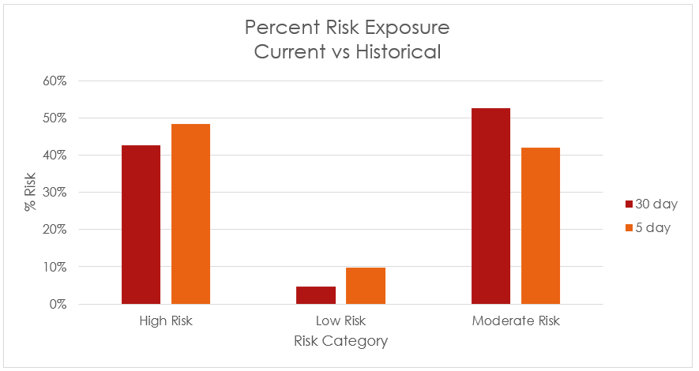
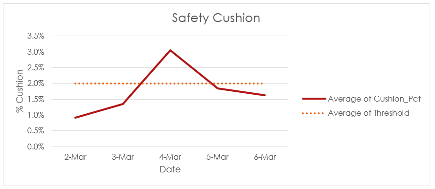
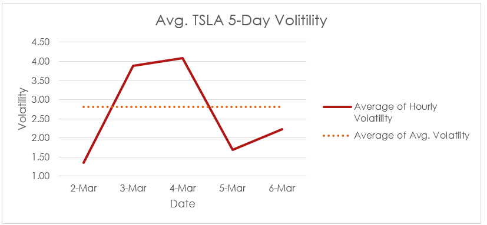
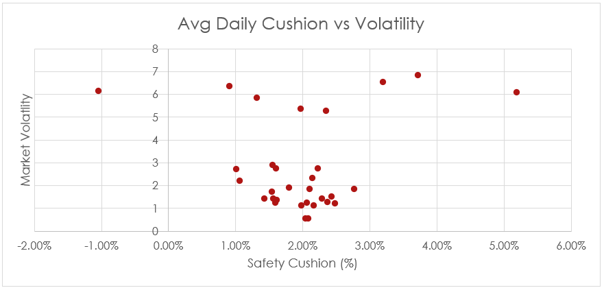
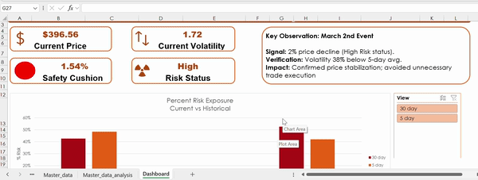

# TSLA Market Risk & Volatility Monitor (Python + Excel)

## Executive Summary
I developed an automated risk-monitoring tool for TSLA that moves beyond basic price alerts by calculating a **2% Safety Cushion**. By combining Python automation with statistical modeling in Excel, I created a system that distinguishes between normal market noise and genuine volatility, successfully identifying stabilized price drops that would typically trigger false alarms.

---

## The Problem
Most stock alerts are one-dimensional because they tell you a price dropped, but not how worried you should be. Without context, a 2% dip could be negligible or the start of a selling crisis. This creates uncertainty in the data, leaving you to second-guess whether the market is just shaky or if it has hit a danger zone. I decided to build a tool to act as a filter that could tell me how much cushion an asset has before it hits a dangerous level and whether the current market conditions are stable or fluctuating.

---

## Method
To move beyond basic price tracking, I set up a two-part risk analysis. It started with Python scraping 5 and 30-day intervals of TSLA (Tesla Inc.) stock prices to catch trend deviations. Once the data was exported to Excel, I calculated a “Normal Price” (5-hour rolling average) to smooth out the noise and find the true momentum. I also created a safety-cushion metric, essentially a 2% danger-zone threshold. To make the data actionable, I designed a dashboard using standard deviation clusters, which helped me distinguish between a high-volatility event and a stabilized descent. This ensured I wasn’t just chasing every price change but was instead responding to meaningful evidence.

---

## Results
By applying this logic to recent TSLA data, I was able to identify several key insights regarding the stock's stability:

### 1. Risk Distribution (Current vs. Historical)

By comparing the current 5-day risk frequency against the 30-day historical baseline, I could see that the stock spent over half the month in a stabilizing ‘Moderate’ phase. This provides a clear visual for the ‘Safety Cushion,’ showing at a glance how much breathing room the stock has before it hits a critical danger zone.

### 2. Price & Volatility Trends

On March 2nd, TSLA’s price dipped into the 'High Risk' zone, breaking the 2% safety limit. In most cases, that’s a red alert that triggers a panic sell. But because this tool tracks more than just price, it showed that volatility was only 1.72, nearly 40% lower than the weekly average. Since the market lacked aggressive momentum, it was identified as a stabilized descent, holding steady rather than reacting to a false alarm.

### 3. Safety Cushion & Volatility Correlation

By mapping market speed against the safety cushion, the exact kind of dip that occurred could be identified. This tool shows when a move is actually controlled, as was seen on March 2nd, giving the green light to stay the course and save defensive actions for true 'Panic Zone' moments.

---

## 🎥 Dashboard Demonstration

---

## Strategic Recommendations
* **Set Thresholds for Action:** By using the Safety Cushion to pre-define exactly when a dip officially becomes a danger zone, the business can remove emotion from the room. This gives a clear signal: either the market is just settling, or it’s time for intervention.
* **Filter the Noise to Save Time:** The Stability Note should be the first thing anyone looks at. Instead of the team spending hours investigating every price drop, further investigation is only needed when the system flags a High Volatility event. 
* **Operationalize the Why:** By integrating Standard Deviation Clusters into regular reporting, the business can show the quality of market movement. This helps distinguish between a healthy correction and a genuine breakdown.
* **Scale the Automation:** Since the Python-to-Excel pipeline is established for TSLA, this same Safety Cushion logic can be applied across the rest of a portfolio to ensure planning is based on accurate, contextual data.

---

## Project Toolkit
* **Tools:** Python (yfinance, Pandas), Excel (Pivot Tables).
* **AI Collaboration:** I leveraged **Gemini (Google's AI)** to assist with code optimization and logic brainstorming.
* **File Structure:**
*   * `/Data`: Contains raw 5-day/30-day source files, the master data sheet, and the `.py` script.
    * `/Images`: Screenshots of trend analysis and risk distribution.
    * `TSLA_Risk_Monitor_Dashboard.xlsx`: The final interactive tool.

---

### ⚠️ Disclaimer
This project is for educational and portfolio purposes only. The analysis, "Safety Cushion" metric, and volatility models developed here are intended to demonstrate data analytical skills. They do not constitute financial advice. Trading stocks involves high risk; please consult a financial professional before making any investment decisions.
